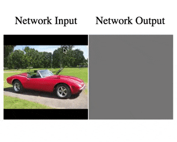

# Latent Composition
[Project Page](https://chail.github.io/latent-composition/) |  [Paper](http://arxiv.org/abs/2103.10426) | [Bibtex](https://chail.github.io/latent-composition/bibtex.txt)

 

Using latent space regression to analyze and leverage compositionality in GANs.\
*International Conference on Learning Representations, 2021*\
[Lucy Chai](http://people.csail.mit.edu/lrchai/), [Jonas Wulff](http://people.csail.mit.edu/jwulff/), [Phillip Isola](http://web.mit.edu/phillipi/)

## Prerequisites
- Linux
- Python 3
- NVIDIA GPU + CUDA CuDNN

**Table of Contents:**<br>
1. [Colab](#colab) - run it in your browser without installing anything locally<br>
2. [Setup](#setup) - download pretrained models and resources
3. [Pretrained Models](#pretrained) - quickstart with pretrained models<br>
3. [Notebooks](#notebooks) - jupyter notebooks for interactive composition<br>
4. [Training](#training) - pipeline for training encoders<br>

<a name="colab"/>

## Colab

1. [Interactive Masking Demo](https://colab.research.google.com/drive/1p-L2dPMaqMyr56TYoYmBJhoyIyBJ7lzH?usp=sharing): Demonstrates using a masked encoder to investigate image priors in GANs.
2. [Interactive Composition Demo](https://colab.research.google.com/drive/1j7Bz9vdVnxzOgokawA39hCJZLTmVDq6_?usp=sharing): Interface to compose multiple images using masked encoder.
3. [Finetune and Edit](https://colab.research.google.com/drive/1zpD_UYqiGqjzftYxHQPy4sxOQTWV_QY9?usp=sharing): For real images, finetune the encoder towards a specific image for better reconstruction. Further composition can be done in real time.

<a name="setup"/>

## Setup

- Clone this repo:
```bash
git clone https://github.com/chail/latent-composition.git
```

- Install dependencies:
	- we provide a Conda `environment.yml` file listing the dependencies. You can create a Conda environment with the dependencies using:
```bash
conda env create -f environment.yml
```

- Download resources:
	- we provide a script for downloading associated resources. Fetch these by running:
```bash
bash resources/download_resources.sh
```

<a name="pretrained"/>

## Quickstart with pretrained models

Pretrained models will be automatically downloaded via PyTorch Hub. The above resources should also be downloaded via the download script for automatic collaging.

See the following code snippet for a basic example. An notebook format is provided in `notebooks/quickstart.ipynb`

```python
from networks import networks
from utils import masking

nets = networks.define_nets('proggan', 'celebahq')
# proggan: celebahq, livingroom, church
# stylegan: ffhq, church, car, horse

with torch.no_grad():
    im = nets.seed2image(1,seed=10)
    hints, mask = masking.mask_upsample(im)
    rec = nets.invert(hints, mask=mask)
```

<a name="notebooks"/>

## Notebooks

*Important*: First, setup symlinks required for notebooks: `bash notebooks/setup_notebooks.sh`, and add the conda environment to jupyter kernels: `python -m ipykernel install --user --name latent-composition`. 

We provide a few interactive examples:
1. `notebooks/quickstart.ipynb`: basic usage example
2. `notebooks/interactive-masking.ipynb`: investigate GAN priors from incomplete images
3. `notebooks/interactive-composition.ipynb`: compose multiple images
4. `notebooks/finetune-and-edit.ipynb`: finetune the model on a real image, and then compose in real-time


<a name="training"/>

## Training

Coming soon!


### TODOs
- [ ] Add experiment scripts
- [ ] Add training code
- [ ] Website: Webpage of random samples 

### Acknowledgements

We thank the authors of these repositories:
- [Gan Seeing](https://github.com/davidbau/ganseeing) for GAN and visualization utilities
- [StyleGAN 2 Pytorch](https://github.com/rosinality/stylegan2-pytorch) for pytorch implementation of StyleGAN 2 and pretrained models
- [Pixel2Style2Pixel](https://github.com/eladrich/pixel2style2pixel) for identity loss implementation
- [Pytorch FID](https://github.com/mseitzer/pytorch-fid) for FID implementation

<a name="citation"/>

### Citation
If you use this code for your research, please cite our paper:
```
@inproceedings{chai2021latent,
  title={Using latent space regression to analyze and leverage compositionality in GANs},
  author={Chai, Lucy and Wulff, Jonas and Isola, Phillip},
  booktitle={International Conference on Learning Representations},
  year={2021}
 }
```

